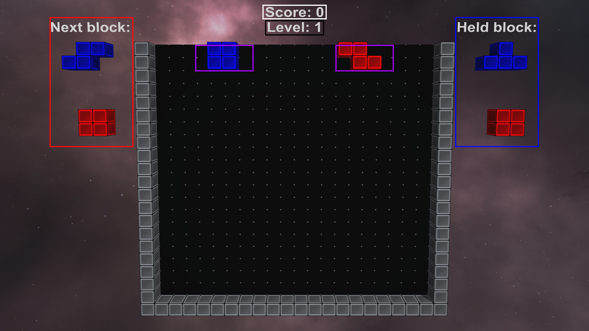
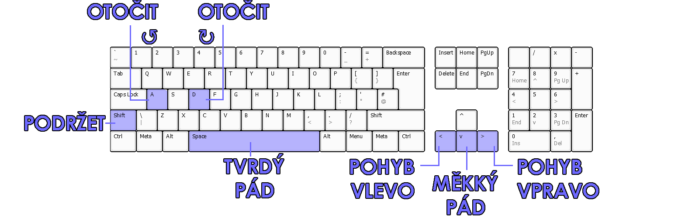
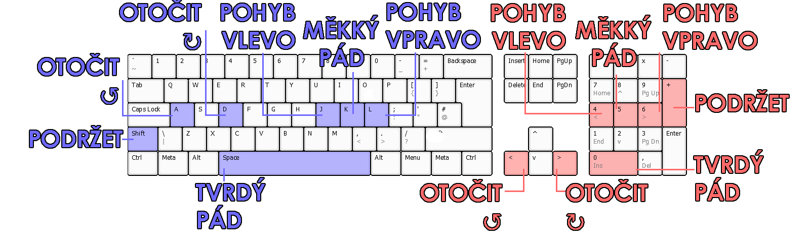

# Uživatelská dokumentace

## O projektu

Maturitní projekt Kooperativní Tetris vychází ze známé arkádové hry [Tetris](https://en.wikipedia.org/wiki/Tetris),
která byla vytvořena již roku 1984 [Alexeyem Pajitnovem](https://en.wikipedia.org/wiki/Alexey_Pajitnov). Jde o vlastní
implementaci této klasické hry v oblíbeném herním enginu [Unity](https://en.wikipedia.org/wiki/Unity_(game_engine)).
Nejdůležitějším originálním prvkem této implementace hry je kooperativní režim, ve kterém se hrácí pole rozšíří pro
další hráče, kteří následně spolupracují a snaží se dosáhnout společného skóre.

## Pravidla

- Hráči mají za úkol vyčistit jedotlivé řádky tím, že je zaplní [tetrominy](https://en.wikipedia.org/wiki/Tetromino) (
  dále nazýváno pouze *bloky*).
- Každý hráč může v jednom okamžiku ovládat pouze jeden blok.
- Gravitace se s roustoucí úrovní postupně zvyšuje, což zrychluje tempo hry.
- Skóre i obtížnost je pro všechny hráče společná.
- Hra je prohraná, když není kde vygenerovat další blok.

## Rozložení herních prvků

- **Červený rámeček**: Zde se zobrazují **bloky "ve frontě"**, které hráči dostanou po
  uzamčení aktivního bloku (_a nebo pokud použili tlačítko podržení a nedrží zatím žádný blok_).
- **Modrý ráměček**: V tomto prostoru se zobrazují **podržené** bloky.
- **Fialové ráměčky**: Prostor, ve kterém se objeví **nové bloky** po uzamčení předešlých.
- <mark style = "background:white"> **Černý</mark> ráměček**: Aktuální rychlostní úroveň
- <mark style = "background:black"> **Bílý</mark> ráměček**: Aktuální skóre (viz. [bodování](#bod))

## Ovládání

_**Pohyb:**_

- **Pohyb doprava**: Přesune blok o 1 kostku doprava + spustí automatické opakování, pokud je držen po dobu 0,3 s.
- **Přesun doleva**: Přesune blok o 1 kostku doleva + spustí automatické opakování, pokud je držen po dobu 0,3 s.
- **Měkký pád**: Přesune blok dolů 20krát rychleji, než je normální rychlost pádu.
- **Tvrdý pád**: Přesune blok na zem a okamžitě zablokuje aktivní blok.

_**Rotace:**_

- **Rotace po směru hodinových ručiček**: Otočí blok o 90° ve směru hodinových ručiček
- **Otočení proti směru hodinových ručiček**: Otočí blok o 90° proti směru hodinových ručiček.

_**Ostatní:**_

- **Podržet**: Přesune aktuálně aktivní blok do oblasti podržení a okamžitě vytvoří nový blok.

> [!TIP]
> Po použití funkce podržení musí být blok uzamčen, aby se funkce znovu aktivovala.

## Rozložení ovládacích prvků

**Rozložení ovládacích prvků pro každého hráče závisí na počtu hráčů:**

- Hra jednoho hráče
    
  
- Kooperace dvou hráčů
    
  
- Kooperace tří hráčů
    
  

## Bodování

Následující tabulka vysvětluje bodování hry:

| Úkon               | Počet bodů    | Popis                                          |
|--------------------|---------------|------------------------------------------------|
| Single             | 100 x úroveň  | 1 vyčištěný řádek                              |
| Double             | 300 x úroveň  | 2 naráz vyčistěné řádky                        |
| Triple             | 500 x úroveň  | 3 naráz vyčištěné řádky                        |
| Tetris             | 800 x úroveň  | 4 naráz vyčištěné řádky                        |
| Mini T-Spin*       | 100 x úroveň  | Jedodušší forma T-Spinu, bez vyčíštěného řádku |
| Mini T-Spin Single | 200 x úroveň  | Jednodušší forma T-Spinu, 1 vyčištěný řádek    |
| T-Spin*            | 400 x úroveň  | T-Spin, bez vyčištěného řádku                  |
| T-Spin Single      | 800 x úroveň  | T-Spin, 1 vyčištěný řádek                      |
| T-Spin Double      | 1200 x úroveň | T-Spin, 2 naráz vyčištěné řádky                |
| T-Spin Triple      | 1600 x úroveň | T-Spin, 3 naráz vyčištěné řádky                |
| Měkký pád          | 1 x *n*       | Blok je pomocí měkkého pádu shozen o *n* řádků |
| Tvrdý pád          | 2 x *m*       | Blok je pomocí tvrdého pádu shozen o *m* řádků |
| Back-to-Back       | 0.5 x úkony   | Bonus za dva po sobě jdoucí *složité úkony***  |

*Mechanika **T-Spinu** a **Mini T-Spinu** popsána podrobně [**zde**](https://tetris.fandom.com/wiki/T-Spin), ****Složité
úkony**: Tetris, Mini T-Spin Single, T-Spin Single, T-Spin Double, T-Spin Triple
