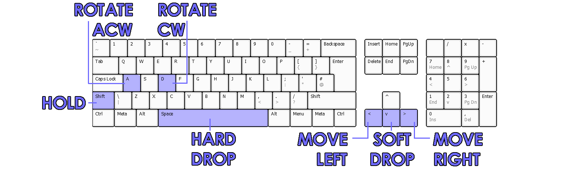
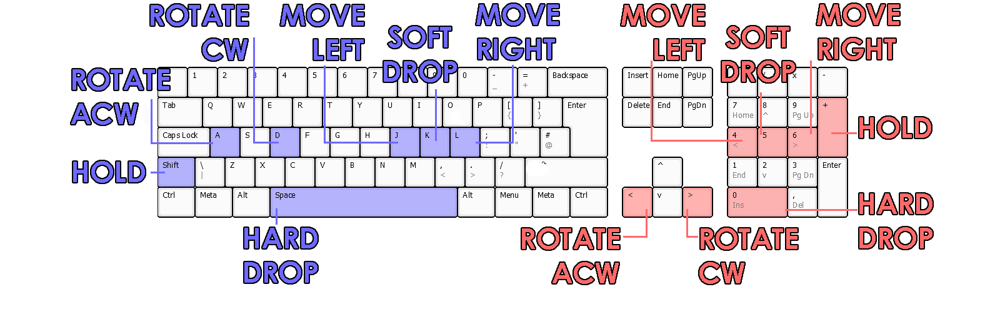
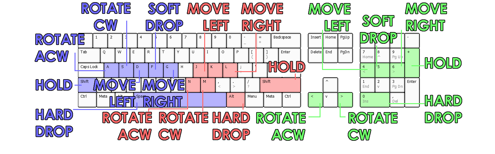

# User documentation
## Rules

- Players have to clear rows by filling them with [Tetrominos](https://en.wikipedia.org/wiki/Tetromino) (later called *blocks*). 
- Only one block per player can be controlled at one time.
- Players can switch the currently active block using the hold button.
- The game gets progressively faster as the number of cleared rows increases.
- The score is shared between all players and there are no individual goals.
- The game is lost when there is no place to generate another block.

## Controls

_**Movement:**_
- **Move Right**: Moves the block 1 cube right + triggers auto-repeat if held for 0.3s
- **Move Left**: Moves the block 1 cube left + triggers auto-repeat if held for 0.3s
- **Soft Drop**: Moves the block down 20 times faster than normal fall speed
- **Hard Drop**: Moves the block to ground and immediately locks the active block

_**Rotation:**_
- **Rotate Clockwise**: Rotates the block 90° clockwise
- **Rotate Anticlockwise**: Rotates the block 90° anticlockwise

_**Other:**_
- **Hold**: Moves the currently active block to the holding area and immediately spawns new 
> [!NOTE]
> After using hold, a block must be locked to re-enable the function

## Control layouts
**The control layout for each player depends on the player count:**
- **Single player**

- **Two player Co-op**

- **Three player Co-op**
