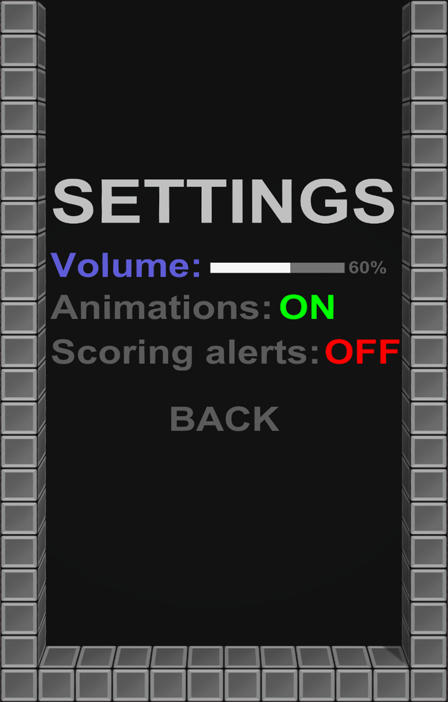

# Uživatelská dokumentace

## 1. O projektu

Maturitní projekt Kooperativní Tetris vychází ze známé arkádové hry [Tetris](https://en.wikipedia.org/wiki/Tetris),
která byla vytvořena již roku 1984 [Alexeyem Pajitnovem](https://en.wikipedia.org/wiki/Alexey_Pajitnov). Jde o vlastní
implementaci této klasické hry v oblíbeném herním enginu [Unity](https://en.wikipedia.org/wiki/Unity_(game_engine)).
Nejdůležitějším originálním prvkem této implementace hry je kooperativní režim, ve kterém se hrácí pole rozšíří pro
další hráče, kteří následně spolupracují a snaží se dosáhnout společného skóre.

## 2. Instalace a spuštění

## 3. Pravidla

- Hráči mají za úkol **vyčistit jedotlivé řádky** tím, že je zaplní [tetrominy](https://en.wikipedia.org/wiki/Tetromino) (dále nazýváno pouze ***bloky***).
- Každý hráč může v jednom okamžiku ovládat pouze jeden blok. (viz. [ovládání](#6))
- Gravitace se s roustoucí úrovní postupně zvyšuje, což zrychluje hru a zvyšuje obtížnost a skóre.
- Skóre i obtížnost je společná pro všechny hráče.
- Hra je prohraná, když není kde vygenerovat další blok.

## 4. Popis herního pole

### 4.1 Ukázka

### 4.2 Legenda
#### 4.2.1 Prvky související s bloky
- **Červený rámeček**: Zde se zobrazují **bloky "ve frontě"**, které hráči dostanou po
  uzamčení aktivního bloku (_a nebo pokud použili tlačítko podržení a nedrží zatím žádný blok_).
- **Modrý ráměček**: V tomto prostoru se zobrazují **podržené** bloky.
- **Fialové ráměčky**: Prostor, ve kterém se objeví **nové bloky** po uzamčení předešlých.
#### 4.2.2 Informační prvky
- **Černý** rámeček: Aktuální rychlostní úroveň
- <mark style = "background:black"> **Bílý</mark> ráměček**: Aktuální skóre (viz. [bodování](#bod))

## 5. Rozložení menu

### 5.1 Ukázky:
#### 5.1.1 Menu pozastavené hry

  

#### 5.1.2 Menu prohrané hry

  

#### 5.1.3 Nastavení

  

### 5.2 Legenda:
#### 5.2.1 Menu pozastavené hry:
- **Settings**: Otevře menu s nastavením.
- **Restart**: Restartuje hru (počet hráčů zůstává stejný).
- **Exit**: Opustí hru.
- **Add player**: Přidá do hry hráče, rozšíří hrací pole.
- **Remove player**: Odebere ze hry hráče, zúží hrací pole.

#### 5.2.2 Menu prohrané hry:
- **Score**: Dosažené skóre
- **High score**: Nejvyšší dosažené skóre
- **Restart**: Restartuje hru.
  - _Počet hráčů zůstává stejný._
- **Exit**: Opustí hru.

#### 5.2.3 Nastavení:
- **Volume**: Nastavení hlasitosti.
  - _Ovládání pomocí pravé a levé šipky_
- **Animations**: Přepíná stav animací.
  - _OFF = vypnuté animace, ON = zapnuté animace_
- **Back**: Vrátí Vás do menu pozastavené hry.

## 6. Ovládání

### 6.1 Rozložení ovládacích prvků
#### 6.1.1 Hra jednoho hráče:
  

#### 6.1.2 Kooperace dvou hráčů:
  

#### 6.1.3 Kooperace tří hráčů:
  

### 6.2.1 Legenda
#### 6.2.1 Pohyb:

- **Pohyb doprava**: Přesune blok o 1 kostku doprava + spustí automatické opakování, pokud je držen po dobu 0,3 s.
- **Přesun doleva**: Přesune blok o 1 kostku doleva + spustí automatické opakování, pokud je držen po dobu 0,3 s.
- **Měkký pád**: Přesune blok dolů 20krát rychleji, než je normální rychlost pádu.
  - _Za měkký pád jsou přičítány body viz. [bodování](#7)_
- **Tvrdý pád**: Přesune blok na zem a okamžitě zablokuje aktivní blok.
  - _Za tvrdý pád jsou přičítány body viz. [bodování](#7)_

#### 6.2.2 Rotace:

- **Rotace po směru hodinových ručiček**: Otočí blok o 90° ve směru hodinových ručiček
- **Otočení proti směru hodinových ručiček**: Otočí blok o 90° proti směru hodinových ručiček.

#### 6.2.3 Ostatní:

- **Podržet**: Přesune aktuálně aktivní blok do oblasti podržení a okamžitě vytvoří nový blok.
  - _Po použití funkce podržení musí být blok uzamčen, aby se funkce znovu aktivovala._
  

## 7. Bodování

### 7.1 Tabulka bodování
Následující tabulka vysvětluje bodování hry:

| Úkon               | Počet bodů    | Popis                                          |
|--------------------|---------------|------------------------------------------------|
| Single             | 100 x úroveň  | 1 vyčištěný řádek                              |
| Double             | 300 x úroveň  | 2 naráz vyčistěné řádky                        |
| Triple             | 500 x úroveň  | 3 naráz vyčištěné řádky                        |
| Tetris             | 800 x úroveň  | 4 naráz vyčištěné řádky                        |
| Mini T-Spin*       | 100 x úroveň  | Jedodušší forma T-Spinu, bez vyčíštěného řádku |
| Mini T-Spin Single | 200 x úroveň  | Jednodušší forma T-Spinu, 1 vyčištěný řádek    |
| T-Spin*            | 400 x úroveň  | T-Spin, bez vyčištěného řádku                  |
| T-Spin Single      | 800 x úroveň  | T-Spin, 1 vyčištěný řádek                      |
| T-Spin Double      | 1200 x úroveň | T-Spin, 2 naráz vyčištěné řádky                |
| T-Spin Triple      | 1600 x úroveň | T-Spin, 3 naráz vyčištěné řádky                |
| Měkký pád          | 1 x *n*       | Blok je pomocí měkkého pádu shozen o *n* řádků |
| Tvrdý pád          | 2 x *m*       | Blok je pomocí tvrdého pádu shozen o *m* řádků |
| Back-to-Back       | 0.5 x úkony   | Bonus za dva po sobě jdoucí *složité úkony***  |

*Mechanika **T-Spinu** a **Mini T-Spinu** popsána podrobně [**zde**](https://tetris.fandom.com/wiki/T-Spin), ****Složité
úkony**: Tetris, Mini T-Spin Single, T-Spin Single, T-Spin Double, T-Spin Triple

## 8. Zdroje

### 8.1 Použité knihovny
- **Unity** https://unity.com/
- **C#** https://dotnet.microsoft.com/en-us/languages/csharp
- **DocFX** https://dotnet.github.io/docfx/

### 8.2 Dokumentace
- **Unity** https://docs.unity.com/
- **C#** https://docs.microsoft.com/en-us/dotnet/csharp/
- **DocFX** https://dotnet.github.io/docfx/tutorial/docfx_getting_started.html

### 8.3 Ostatní
- **Hudba**: _8bit Dungeon Boss - Kevin MacLeod_ https://incompetech.com/music/royalty-free/
- **Pozadí**: https://assetstore.unity.com/packages/2d/textures-materials/sky/starfield-skybox-92717